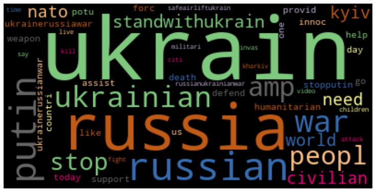
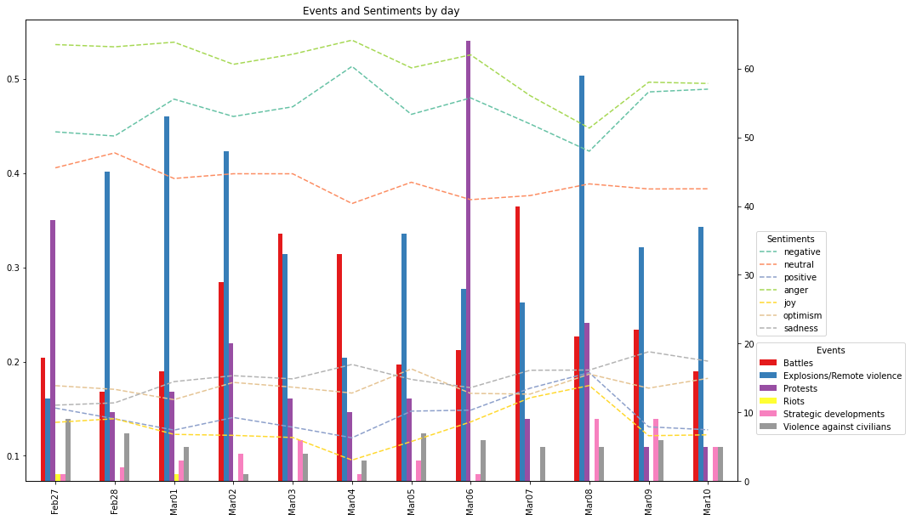
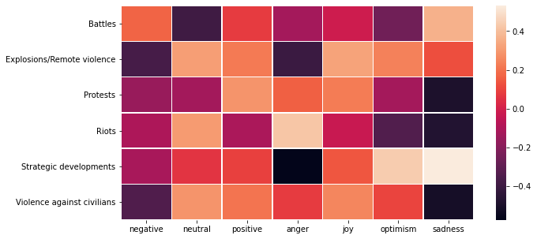

# Analyzing Online Conversations of the 2022 Russian Invasion of Ukraine
---

This analysis was a part of my BAX-452 Machine Learning course final project at UC Davis.

---

## Data Characteristics

For the analysis, we used data from two different datasets, which were linked temporally and topically.

### Twitter Data

We used tweets between the 02-27-2022 to 03-10-2022 from [Ukraine Conflict Twitter Dataset](https://www.kaggle.com/datasets/bwandowando/ukraine-russian-crisis-twitter-dataset-1-2-m-rows). These tweets were then filtered for English only using Twitter's language parameter. These Tweets were further preprocessed and cleaned to prepare them for analysis. For Topic Modeling, they were converted to lowercase, tokenized, stripped of stop words, links, numbers, and symbols before being stemmed using the Porter Stemmer algorithm. For Sentiment Analysis, the only preprocessing done was removing URLs and mentions due to the other factors providing additional context to our models.

### ACLED Data

The Armed Conflict Location & Event Data Project (ACLED) is a non-profit organization that provides reputable granular information about worldwide conflicts such as battles and protests. We used their [Data Export Tool](https://acleddata.com/data-export-tool/) to collect data regarding events of interest in Russia and Ukraine. This data was last updated on 03-11-2022.

## Analyses and Insights

### Topic Modeling on Tweets

The first step in our analysis was to understand the topics that people were talking about. We started with a naive approach of creating a frequency distribution of the words and plotting a word cloud.

This approach was not able to provide us with any meaningful insights due to the most common word stems, somewhat predictably, being based on the words Ukraine, Russia, Putin, and War.

Our next approach was to use Latent Dirichlet Allocation (LDA) to cluster similar topics. We then mapped out the most prominent topics using the words, their weights, and some context through the content of the Tweet and news.

| Word Stems                                            | Interpreted Topic                                                                                           |
| ----------------------------------------------------- | ----------------------------------------------------------------------------------------------------------- |
| ukrain, student, border, indian, poland, evacu        | Indian students stranded at the Ukraine-Poland border in poor conditions after a failed evacuation attempt. |
| ukrain, support, help, nuclear, plant, power          | Russian attack on a Ukrainian nuclear power plant.                                                          |
| ukrain, russian, mariupol, kharkiv, kyiv, armi        | Russian army invasion of the Ukrainian cities of Kyiv, Kharkiv, and Mariupol                                |
| close, ukrain, nato, stoprussia, stopputin, un        | People asking the UN and NATO to intervene and assist Ukraine                                               |
| weapon, provid, defend, humanitarian, putin, civilian | People talking about providing Ukrainian civilians humanitarian aid                                         |

### Sentiment Analysis on Tweets

#### Bag of Words Approach

The first attempt at sentiment analysis used a rudimentary bag of words approach. We used the NLTK corpus through TextBlob which provided us with two metrics- polarity and subjectivity. The polarity score ranged from -1.0 for a very negative sentiment to +1.0 for a very positive sentiment. The subjectivity ranged from 0.0 for very objective statements to +1.0 for very subjective statements. The results from this approach were not promising due to the lack of depth in the sentiment tags and the inability to parse context which is a limitation of the bag of words approach.

#### Transformer Models

To improve the sentiment analysis, we switched to using transformers. We used ROBERTa (Robustly Optimized BERT Pre-training Approach) models. ROBERTa is an optimized variant of BERT (Bidirectional Encoder Representations from Transformers), which is a direction agnostic model that makes use of masking. We used two pre-trained models created by [Cardiff NLP](https://huggingface.co/cardiffnlp), a research group at Cardiff University. This allowed us to better predict the sentiments for tweets as the models were fine tuned on the TweetEval dataset. Combined together, we had seven labels for each tweet- positive, neutral, negative, joy, optimism, anger, and sadness.

#### Hashtag Mapping

Since hashtags are such an essential part of Tweets, it is important to also understand them. It is difficult to directly analyze the sentiment of a hashtag as they are often made up of acronyms and multiple words without delimiters. To better understand them, we extracted the hashtags from each tweet and used the seven sentiment values derived from the previous exercise as target variables for regressions. The hashtags were then converted to dummy variables whose coefficients would provide context regarding the overall sentiment. We limited the analysis to the top 40 most popular hashtags to avoid outliers.

| Sentiment Label | Top Hashtags (Based on +ve coefficient value)                                 |
| --------------- | ----------------------------------------------------------------------------- |
| negative        | ‘Mariupol', 'SafeAirliftUkraine', 'StopPutin', 'UkraineUnderAttack', 'Putin'  |
| neutral         | 'BREAKING', 'EU', 'China', 'US', 'NATO'                                       |
| positive        | None                                                                          |
| anger           | 'UKRAINE', 'StopRussia', 'StopPutin', 'putin', 'RussianUkrainianWar'          |
| joy             | 'SlavaUkraini', 'Zelenskyy'                                                   |
| optimism        | 'StandWithUkraine', 'StandWithUkraine️', 'China', 'EU', 'SafeAirliftUkraine'  |
| sadness         | 'Mariupol', 'SafeAirliftUkraine', 'UkraineUnderAttack', 'BREAKING', 'Kharkiv' |

As can see from the results, we were able to successfully model the sentiment behind the hashtags which would not be otherwise possible by directly looking at them. Seeming neutral words such as names like Putin and Zelenskyy were correlated with sentiments that make sense given the context.

#### Correlation with Real-World Events

To link the online sentiment with real-world events, we merged the average values for daily sentiment with the count of each event type from the ACLED dataset.

From the graph we can infer that the sentiment is fairly stable, however, there is a noticeable lagged effect. This can be clearly seen from 03-06-2022 to 03-08-2022 when there were a large number of anti-war protests in Russia leading to a drop in anger and negativity.

Additionally, we can also look at the correlation between the event type and sentiment to provide context.

While not perfect, we can see that  types such as protests were positively correlated with positivity and negatively correlated with sadness, whereas event types such as violence against civilians were correlated with anger.
